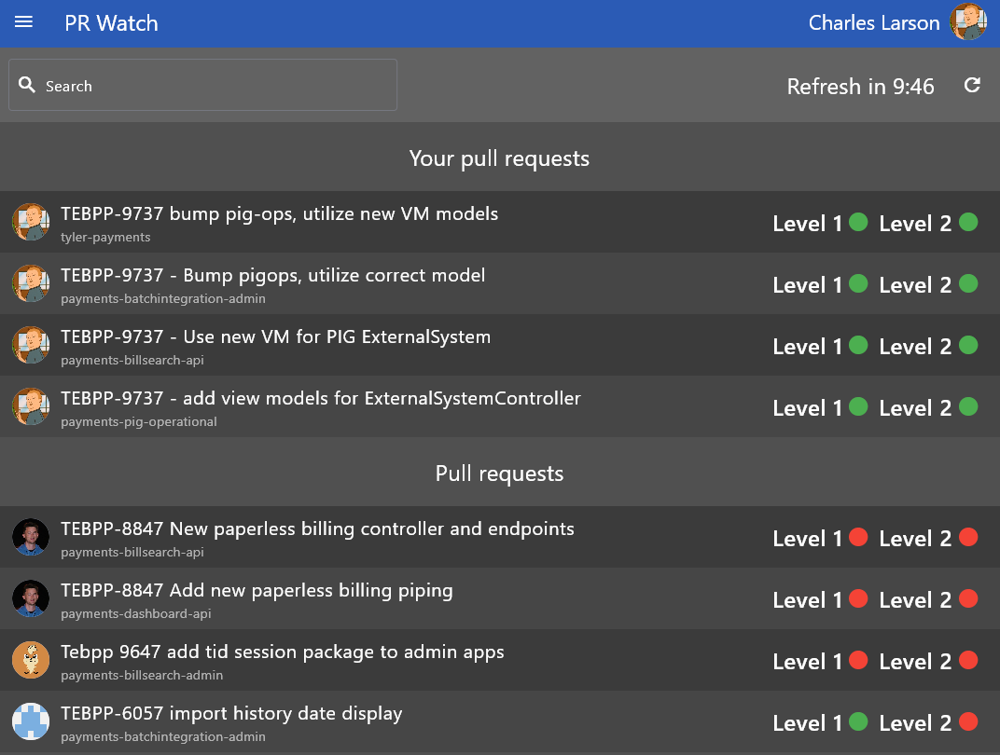

# PR Watch

PR Watch is a multi-platform application designed to monitor pull requests for repositories with a 2-tier review process on your team. It supports Android, iOS, Linux, macOS, Web, and Windows but has only been tested on Windows. The application polls for updates every 10 minutes with the goal of avoiding text channels and ad-hoc messaging to get pull requests reviewed.



## Getting Started

1. **Clone the repository**  
    Run:
    ```
    git clone https://github.com/charles-larson/pr_watch.git
    ```

2. **Install Dependencies**  
    Ensure Flutter is installed. Then run:
    ```
    flutter pub get
    ```

3. **Run the Application**  
    For Windows (or any supported platform), use:
    ```
    flutter run
    ```

## Project Structure
- **lib/**: Dart source code.
- **ios/**, **android/**, **linux/**, **macos/**, **web/**, **windows/**: Platform-specific code and configuration.
- **pubspec.yaml**: Project metadata and dependencies.
- **README.md**: This documentation.
- **LICENSE**: MIT License.

## Building for Different Platforms

Refer to the Flutter documentation for building/releases on various platforms:
- [Build and release an Android app](https://flutter.dev/docs/deployment/android)
- [Build and release an iOS app](https://flutter.dev/docs/deployment/ios)
- [Build and release a macOS app](https://flutter.dev/docs/deployment/macos)
- [Build and release a Linux app](https://flutter.dev/docs/deployment/linux)
- [Build and release a Web app](https://flutter.dev/docs/deployment/web)
- [Build and release a Windows app](https://flutter.dev/docs/deployment/windows)

## License

This project is licensed under the MIT License. See the [LICENSE](./LICENSE) file for details.
